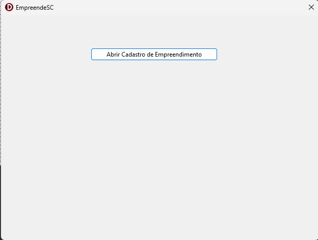
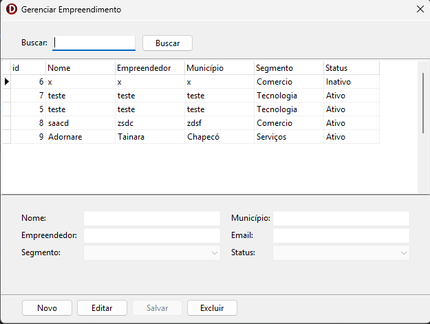

# EmpreendeSC

Sistema desktop desenvolvido em **Delphi** para gerenciamento de empreendimentos.

O objetivo do projeto é demonstrar a implementação de um **CRUD completo** utilizando boas práticas de desenvolvimento, separação de responsabilidades e persistência em banco de dados SQLite.

---

# Tecnologias Utilizadas

* Delphi
* FireDAC
* SQLite
* Arquitetura MVC
* Repository Pattern
* Git para controle de versão

---

# Funcionalidades

O sistema permite o gerenciamento de empreendimentos através das seguintes operações:

* Cadastro de empreendimentos
* Edição de registros
* Exclusão de registros
* Listagem em grid
* Filtros por nome, nome empreendedor e município
* Controle de status (ativo/inativo)

---

# Arquitetura

O projeto foi estruturado utilizando **MVC (Model – View – Controller)** com o objetivo de separar responsabilidades e facilitar manutenção e evolução do código.

Estrutura principal:

```
src
 ├── model
 │   ├── Empreendimento.Model.pas
 │   └── Empreendimento.Enums.pas
 │
 ├── repository
 │   └── Empreendimento.Repository.pas
 │
 ├── view
 │   ├── MenuPrincipal.View.pas
 │   └── Empreendimento.View.pas
 │
 └── database
     ├── DatabaseInitializer.pas
     └── dmDatabase.pas
```

Descrição das camadas:

**Model**

Representa as entidades do domínio e seus atributos.

**Repository**

Responsável pela comunicação com o banco de dados e execução das operações CRUD.

**View**

Camada de interface gráfica responsável pela interação com o usuário.

**Database**

Responsável pela criação do banco e gerenciamento da conexão.

---

# Banco de Dados

O sistema utiliza **SQLite** como banco de dados local.

Na primeira execução do sistema, o banco é criado automaticamente caso não exista.

Tabela principal:

**Empreendimento**

Campos:

* Id
* DataCadastro
* Nome
* Nome Empreendedor
* Município
* Segmento
* Email
* Ativo

---

# Como Executar o Projeto

1. Clonar o repositório

```
git clone https://github.com/PauloEduardoFossa/EmpreendeSC.git
```

2. Abrir o projeto no Delphi

```
EmpreendeSC.dproj
```

3. Compilar e executar a aplicação.

O banco SQLite será criado automaticamente na primeira execução.

---

## Screenshots

### Tela Principal


### Tela Empreendimento


---

# Estrutura do Repositório

```
EmpreendeSC
 ├── src
 ├── docs
 ├── EmpreendeSC.dpr
 ├── EmpreendeSC.dproj
 ├── README.md
 └── .gitignore
```

---

# Autor

Paulo Eduardo Fossá
